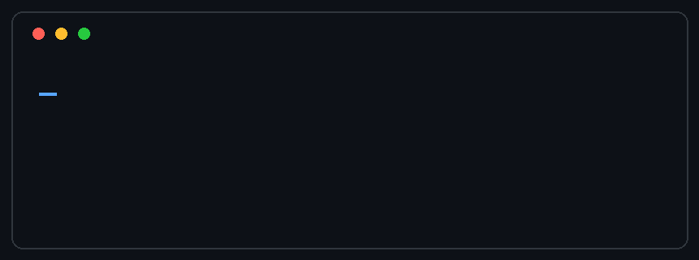
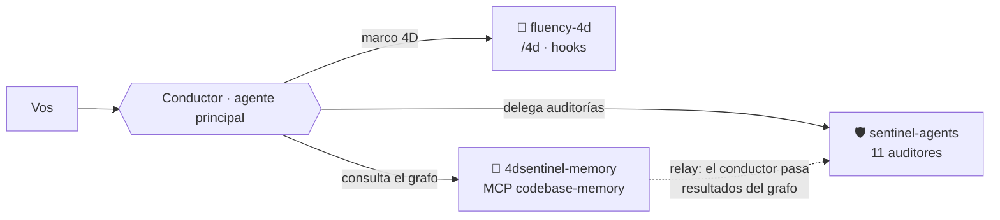

<div align="center">



# 4Dsentinel-suite

**Un ecosistema propio de Claude Code — en un solo install.**
Marco de colaboración humano-IA + agentes de auditoría + memoria de codebase, integrados y en español.

[](LICENSE)
[](https://github.com/alexissamudio/4Dsentinel-suite/actions)


</div>

---

## ¿Qué es? ¿Para quién?

Si trabajás con **Claude Code**, esta suite te da tres capacidades que se potencian entre sí, con
**un solo marketplace**:

1. Una **disciplina para trabajar con la IA** (el marco 4D), no solo "tirar prompts".
2. **Auditores** que revisan tu código, seguridad, compliance y hasta tu **redacción**.
3. Una **memoria de codebase** que entiende tu repo como un **grafo** y respondés preguntas
   estructurales sin leer archivo por archivo.

El hilo conductor es el patrón **conductor**: el agente principal **planifica, delega y verifica**;
delega la auditoría en agentes especializados; consulta el grafo. Vos conservás el criterio.

> **No necesitás memorizar los comandos.** El conductor te **ofrece** indexar o auditar en el
> momento justo (cuando describís que querés entender un repo, o que vas a mergear) — vos solo
> confirmás. Los `/comandos` quedan para cuando preferís invocarlos directo. *Ofrece + confirma,
> nunca actúa solo.*

**Glosario (dos términos que se repiten):**
- **Conductor** — la **sesión principal de Claude Code**, el agente que orquesta: planifica,
  delega en agentes/auditores y verifica. Es *quien* tipeás vos y *quien* consulta el grafo.
- **Relayar** — pasar el resultado de un agente a otro **dentro del brief**. Como los auditores
  no ven el MCP (ni el output de otros agentes), el conductor les **relaya** los datos que
  necesitan (p. ej. el mapa del grafo o un `SENTINEL-REPORT` previo) escribiéndolos en el pedido.

## Contenido

- [¿Qué es? ¿Para quién?](#qué-es-para-quién)
- [fluency-4d — el marco 4D](#-fluency-4d--el-marco-4d)
- [sentinel-agents — los auditores](#-sentinel-agents--los-auditores)
- [4dsentinel-memory — el grafo del codebase](#-4dsentinel-memory--el-grafo-del-codebase)
- [**Requisitos previos**](#requisitos-previos) · [**Instalar**](#instalar) · [Primeros pasos](#primeros-pasos-recién-instalado)
- [Ejemplos reales de salida](#ejemplos-reales-de-salida) · [Recetas](#recetas)
- [Cómo se conectan](#cómo-se-conectan) · [Problemas comunes (FAQ)](#problemas-comunes-faq) · [Para contribuir](#para-contribuir)

> **Tip:** si es tu primera vez, saltá directo a **[Requisitos previos](#requisitos-previos)** e
> **[Instalar](#instalar)** antes de mirar los ejemplos.

---

## 🧭 fluency-4d — el marco 4D

Lleva a la práctica el marco **4D de AI Fluency**. La idea madre: *la mayoría de los fallos con IA
no vienen de un mal prompt, sino de un mal **reparto***. Las cuatro dimensiones:

| Dimensión | Pregunta | Qué hacés |
|---|---|---|
| **Delegación** | ¿Qué hago yo y qué la IA? | Definís el reparto y la frase-objetivo antes de empezar |
| **Descripción** | ¿Cómo le explico lo que quiero? | Armás el pedido en 3 niveles: *Product* (qué), *Process* (cómo), *Performance* (rol/tono) |
| **Discernimiento** | ¿Puedo confiar en lo que me dio? | Evaluás en esos 3 niveles, cazás alucinaciones, hacés un barrido de cobertura |
| **Diligencia** | ¿Quién se hace responsable? | Cerrás con un informe: qué hizo la IA, qué verificar antes de publicar |

**Comandos:**
- **`/4d`** — recorre las 4 dimensiones sobre una tarea concreta, paso a paso.
- **`/4d-init`** — analiza tu proyecto y genera un **CLAUDE.md modular con "puentes"**: docs por
  tema (`auth`, `endpoints`, `database`…) que se **inyectan solos** cuando tu prompt los toca.
- **`/4d-status`** — estado del sistema 4D en el proyecto (puentes, lecciones, métricas). Solo lectura.
- **`/4d-quiz`** — 24 preguntas de práctica de la certificación AI Fluency, con corrección explicada.
- **`/caveman`** — modo de respuestas token-eficiente, opt-in (se prende/apaga).

**Hooks (corren solos, en segundo plano):**
- **`plan_calibrator`** — al entrar en *plan mode*, clasifica la tarea (grande vs chica) y calibra
  el rigor: para algo grande empuja el flujo recon → advisor → plan → critic; para algo trivial, liviano.
- **`bridge_router`** — cuando tu prompt matchea el keyword de un tema, inyecta ese doc antes de responder.
- **`memory_checkpoint`** — al llenarse el contexto, te recuerda guardar el estado de la sesión.
- **`doc_drift`** — si editaste código de un tema, te avisa por si su doc quedó desactualizado.

---

## 🛡️ sentinel-agents — los auditores

**11 agentes read-only** (herramientas `Read`/`Grep`/`Glob`; dos ejecutores con `Bash` pero que
nunca editan). Todos comparten un contrato: **evidencia dura** (`archivo:línea` re-leído), **verdict
parseable**, **severidad calibrada**, y una **auto-verificación adversarial** (cada hallazgo se
marca `CONFIRMED` o `PLAUSIBLE`). Cierran con un bloque `=== SENTINEL-REPORT ===` máquina-legible.

| Agente | Para qué |
|---|---|
| `advisor` | Análisis pre-plan: descubre requisitos ocultos, supuestos y riesgo de alcance |
| `critic` | Verifica la **ejecutabilidad de un plan** contra el código real |
| `code-reviewer` | Review de correctness, calidad y riesgo (verdict `CLEAN/CONCERNS/BLOCKED`) |
| `security-auditor` | Vulnerabilidades explotables (OWASP/CWE, severidad CVSS) |
| `compliance-auditor` | Compliance **ISO 27000** por control-ID, con máquina de estados de evidencia |
| `risk-assessor` | Riesgo de un cambio con rúbrica 1-10 (`PROCEED/CAUTION/DEFER`) |
| `bug-hunter` | Caza bugs de correctitud (lógica, off-by-one, null, races) |
| `librarian` | Lee y resume archivos sin gastar el contexto del hilo principal |
| `validator` | Corre los checks reales (type/lint/test/build) y da verdict binario |
| `debugger` | Reproduce y diagnostica una falla (con timeouts); nunca parchea |
| **`auditor-de-redaccion`** | Califica la **calidad de un texto** (spec/doc/política): completitud, claridad, consistencia, medibilidad, cobertura |

**`/sentinel-audit`** orquesta una **cadena** de agentes con handoff real (ej. security →
compliance → code-review → validate), relayando el reporte de uno como evidencia del siguiente.

**Cómo invocarlos:** el conductor los llama vía la herramienta Agent, ej. pedile
*"revisá este diff con `code-reviewer`"* o *"auditá la redacción de este spec"*.

---

## 🧠 4dsentinel-memory — el grafo del codebase

Cablea el MCP **`codebase-memory`**: indexa tu repo en un **grafo de conocimiento** (parsea el
código con tree-sitter → funciones, clases, llamadas, rutas HTTP, imports) y lo consultás
**estructuralmente**, en vez de `grep`/leer archivo por archivo. Ideal en **repos grandes** —
como orientación, del orden de **cientos de archivos / miles de símbolos** para arriba — donde
"¿quién llama a esta función?" o "¿qué toca este diff?" con grep es lento y ruidoso. En repos
chicos `grep`/`Explore` ya alcanzan y no vale la pena indexar.

**Flujo:** `/suite-setup` (una vez, instala el binario firmado y **registra el MCP** con ruta
absoluta verificada) → `/indexar` un repo → consultás.

| Comando | Qué hace | Ejemplo |
|---|---|---|
| **`/indexar`** `[ruta]` | Indexa el repo en el grafo (deja el artefacto `.codebase-memory/` dentro del repo) | `/indexar` |
| **`/arquitectura`** | Mapa de alto nivel: stack, paquetes, rutas API, *hotspots* (lo más llamado), *clusters* | `/arquitectura` |
| **`/buscar`** `<consulta>` | Busca funciones/clases/rutas por lenguaje natural o patrón | `/buscar login de usuarios` |
| **`/rastrear`** `<función>` | Llamadores/llamados e **impacto** de una función (dónde repercute un cambio) | `/rastrear parseNumberInput` |
| **`/impacto`** `[rango git]` | Mapea un `git diff` a los **símbolos afectados** (útil pre-review/release) | `/impacto` |
| **`/proyectos`** | Lista los proyectos indexados y su estado | `/proyectos` |

**`/indexar` y "Index this project" son lo mismo:** `/indexar` es solo el comando en español que
**envuelve la tool `index_repository`** del MCP. Pedirle al conductor *"Index this project"* (o
invocar la tool directo) hace exactamente lo mismo — una única capa, dos formas de llamarla.

**Nota de arquitectura:** los agentes de plugin **no ven** servidores MCP, así que el grafo lo
consulta el **conductor** (el agente principal) y **relaya** los resultados a los auditores en el
brief (mismo patrón de handoff que sentinel).

---

## Ejemplos reales de salida

**Auditoría de redacción** — `sentinel-agents:auditor-de-redaccion` sobre un doc:

```
=== SENTINEL-REPORT ===
agent: auditor-de-redaccion
verdict: NECESITA_REVISION
findings:
- id: Gap@README.md:16
  severity: Important
  status: CONFIRMED
  evidence: README.md:16-22 (seccion "Instalar")
  summary: No hay requisitos previos; el lector externo no sabe que necesita antes de instalar.
- id: Ambiguedad@README.md:27
  severity: Important
  status: CONFIRMED
  evidence: README.md:27 ("el conductor consulta el grafo y relaya al resto")
  summary: Jerga sin definir ("conductor", "relaya"); un usuario externo no puede interpretarla.
uncertainty: desconozco si hay un doc de instalacion separado al que se delegue intencionalmente.
=== END ===
```

**Mapa de arquitectura** — `/arquitectura` sobre un full-stack real (~6.500 archivos):

```
Stack:    Python (Django + DRF) 116 archivos · JavaScript (React) 24
Rutas:    /api/auth/login · /api/inventario/{productos,compras,maquinaria} · ...
Hotspots: OrdenViewSet.create (fan-in 106) · Orden.save (54) · DashboardResumenView.get (45)
Clusters: frontend (160 nodos, cohesion 0.84) · backend-ordenes · backend-caja · ...
```

**Impacto de una función** — `/rastrear parseNumberInput` (dónde repercute un cambio):

```
54 llamadores en 2 saltos: StockView, ExpensesView, CashHistoryView, NewOrderView,
AccountsReceivableView, DashboardView, StatsView, AgendaView, lib/utils, lib/ticketPrint...
```

## Recetas

**Entender un repo nuevo (sin leerlo entero):**
```
/indexar               # construye el grafo del repo
/arquitectura          # stack, rutas, hotspots, clusters
/buscar autenticacion  # encontra el codigo de auth en el grafo
```

**Auditar antes de mergear:**
```
/impacto               # que simbolos toca tu diff (git)
# pedile al conductor: "revisa el diff con code-reviewer y corre validator"
```

**Aplicar el 4D a una feature:**
```
/4d "agregar exportacion a PDF de los reportes"
# recorre Delegacion -> Descripcion -> Discernimiento -> Diligencia,
# ofreciendo (opt-in) delegar el gap-analysis en sentinel-agents:advisor
```

**Calificar un spec/doc antes de actuar sobre el:**
```
# pedile: "audita la redaccion de docs/spec-feature.md con auditor-de-redaccion"
# devuelve verdict + [Gap]/[Ambiguedad] + las preguntas que los cierran
```

## Requisitos previos

- **Claude Code** (CLI o app de escritorio).
- **git** + **gh** (GitHub CLI) para instalar desde GitHub y verificar firmas.
- **`gh` autenticado** (`gh auth login`) **antes** de correr `/suite-setup`: la verificación de
  la atestación (`gh attestation verify`) consulta la API de GitHub y **falla sin sesión**.
- Para el grafo: `/suite-setup` baja el binario **firmado** (sigstore + SLSA L3, con checksum) de
  [`codebase-memory-mcp`](https://github.com/DeusData/codebase-memory-mcp) — no se vendoriza.
- Para desarrollar la suite: **[uv](https://docs.astral.sh/uv/)** (Python).
- SO: Windows / macOS / Linux (los hooks se prueban en Ubuntu + Windows).

## Instalar

```bash
claude plugin marketplace add alexissamudio/4Dsentinel-suite
claude plugin install fluency-4d@4Dsentinel-suite
claude plugin install sentinel-agents@4Dsentinel-suite
claude plugin install 4dsentinel-memory@4Dsentinel-suite
```

Después: reiniciá Claude Code, corré **`/suite-setup`** y reiniciá otra vez.
**Verificar:** `/mcp` muestra `codebase-memory` conectado y aparecen los agentes `sentinel-agents:*`.
*(No hay batch install: un `marketplace add` + un `install` por plugin.)*

## Primeros pasos (recién instalado)

El camino mínimo para ver la suite funcionando desde cero:

1. **Reiniciá** Claude Code — los plugins cargan al arrancar.
2. **Activá la memoria (una sola vez):** corré **`/suite-setup`** (instala el binario del grafo) y
   **reiniciá** de nuevo. Confirmá con **`/mcp`** que `codebase-memory` figura *conectado*.
3. **Probá el marco 4D:** **`/4d "una tarea tuya"`** — te guía por Delegación → Descripción →
   Discernimiento → Diligencia. O **`/4d-status`** para ver el estado 4D en un proyecto.
4. **Indexá un repo (ideal uno grande):** abrí Claude Code en ese repo y corré **`/indexar`**. Después:
   - **`/arquitectura`** — el mapa del sistema (stack, rutas, hotspots).
   - **`/buscar <algo>`** — encontrá código en el grafo (ej. `/buscar login`).
   - **`/rastrear <función>`** — quién la llama e impacto de un cambio.
5. **Pedí una auditoría:** *"revisá este diff con `code-reviewer`"*, *"auditá `auth.py` con
   `security-auditor`"*, o *"auditá la redacción de este spec con `auditor-de-redaccion`"*.

> **Cómo se invoca cada cosa:** los **`/comandos`** son de fluency-4d y de memory (los tipeás).
> Los **auditores** (`code-reviewer`, `security-auditor`, `auditor-de-redaccion`…) se los pedís al
> conductor en lenguaje natural — no llevan `/`.

## Cómo se conectan



## Problemas comunes (FAQ)

- **El MCP `codebase-memory` no aparece en `/mcp`.** Corré **`/suite-setup`** (instala el binario
  firmado y **registra el MCP** con `claude mcp add`, ruta absoluta verificada) y **reiniciá**
  Claude Code — el MCP se conecta al arrancar.
- **No aparecen los agentes `sentinel-agents:*`.** Chequeá `claude plugin list`: si el plugin está
  `disabled`, corré `claude plugin enable sentinel-agents@4Dsentinel-suite` y reiniciá.
- **Cambié/actualicé algo y no se refleja.** Los plugins cargan **al arrancar**: tras un
  `plugin update` o `marketplace update`, reiniciá.
- **¿Cómo verifico una instalación exitosa?** `/mcp` muestra `codebase-memory` conectado, los
  agentes `sentinel-agents:*` aparecen en la lista, y `/4d-status` responde.
- **Desinstalar:** `claude plugin uninstall <plugin>@4Dsentinel-suite` (y opcional
  `claude plugin marketplace remove 4Dsentinel-suite`).

## Para contribuir

Monorepo **plano**: cada plugin en `plugins/<nombre>/`, sus tests en `tests/<nombre>/`, los
scripts de desarrollo (con prefijo por plugin) en `scripts/`. Docs por plugin en
[`docs/fluency-4d.md`](docs/fluency-4d.md), [`docs/sentinel-agents.md`](docs/sentinel-agents.md) y
[`docs/4dsentinel-memory.md`](docs/4dsentinel-memory.md).
El CI (`validate.yml`) corre por plugin: JSON válido, versiones sincronizadas, `ruff`, `pytest`, y
los validadores de contrato (`check_agents.py`, `*_check_skills.py`, `check_kb_blank.py`,
`check_commands.py`). Regla: **tag/release solo tras CI verde**.

## Licencia

[MIT](LICENSE). La base de conocimiento ISO 27000 de sentinel-agents viaja **en blanco** y está
protegida por checksum (nunca se commitean resultados de auditoría de vuelta).
