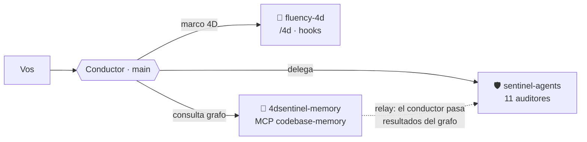

<div align="center">


# 4Dsentinel-suite

**Un ecosistema propio de Claude Code — en un solo install.**
Marco de colaboración humano-IA + agentes de auditoría + memoria de codebase, integrados y en español.

[](LICENSE)
[](https://github.com/alexissamudio/4Dsentinel-suite/actions)


</div>

---

## ¿Qué es? ¿Para quién?

Si trabajás con **Claude Code** —sobre todo en **codebases grandes**— esta suite te da tres cosas
que se potencian entre sí, con **un solo marketplace**:

1. Una **disciplina para trabajar con la IA** (el marco 4D), no solo "tirar prompts".
2. **Auditores** que revisan tu código, tu seguridad, tu compliance y hasta tu **redacción**.
3. Una **memoria de codebase** (grafo) que evita leer archivo por archivo y **ahorra tokens**.

Todo pensado para el patrón **conductor**: el agente principal planifica y coordina; delega en
auditores; consulta el grafo. Vos conservás el criterio.

## Los 3 plugins

| Plugin | Qué trae | Cómo lo usás |
|--------|----------|--------------|
| 🧭 **fluency-4d** | Marco 4D de AI Fluency (Delegación · Descripción · Discernimiento · Diligencia) + CLAUDE.md modular con "puentes" + hooks (calibrador de plan, checkpoint de memoria, doc-drift) | `/4d` · `/4d-init` · `/4d-status` · `/4d-quiz` · `/caveman` |
| 🛡️ **sentinel-agents** | 11 auditores read-only con evidencia dura y verdict parseable | Agentes `sentinel-agents:*` (abajo) + `/sentinel-audit` |
| 🧠 **4dsentinel-memory** | Cablea el MCP `codebase-memory` (grafo del codebase) vía `mcpServers` | `/suite-setup` (una vez) + comandos `/indexar`, `/buscar`… |

### 🛡️ Agentes de sentinel-agents
`advisor` · `critic` · `code-reviewer` · `security-auditor` · `compliance-auditor` (ISO 27000) ·
`risk-assessor` · `bug-hunter` · `librarian` · `validator` · `debugger` · **`auditor-de-redaccion`**
(califica la calidad de un texto/spec: completitud, claridad, consistencia, medibilidad, cobertura).

### 🧠 Comandos de 4dsentinel-memory (en español)
| Comando | Qué hace |
|---|---|
| `/indexar [ruta]` | Indexa el repo en el grafo (deja el artefacto dentro del repo) |
| `/arquitectura` | Mapa: stack, rutas, hotspots, clusters |
| `/buscar <consulta>` | Busca funciones/clases/rutas en el grafo (en vez de grep) |
| `/rastrear <función>` | Llamadores e impacto de una función |
| `/impacto [rango git]` | Cambios de git → símbolos afectados |
| `/proyectos` | Proyectos indexados |

## Requisitos previos

- **Claude Code** (CLI o app de escritorio).
- **git** + **gh** (GitHub CLI) para instalar desde GitHub y verificar firmas.
- Para el MCP de memoria: `/suite-setup` baja el binario **firmado** (sigstore + SLSA L3) de
  [`codebase-memory-mcp`](https://github.com/DeusData/codebase-memory-mcp) — no se vendoriza.
- Para desarrollar la suite: **[uv](https://docs.astral.sh/uv/)** (Python).
- SO: Windows / macOS / Linux (los hooks se prueban en Ubuntu + Windows).

## Instalar

```bash
claude plugin marketplace add alexissamudio/4Dsentinel-suite
claude plugin install fluency-4d@4Dsentinel-suite
claude plugin install sentinel-agents@4Dsentinel-suite
claude plugin install 4dsentinel-memory@4Dsentinel-suite
```

Después: reiniciá Claude Code, corré **`/suite-setup`** (instala el binario del MCP) y reiniciá
otra vez. **Verificar:** `/mcp` muestra `codebase-memory` conectado, y aparecen los agentes
`sentinel-agents:*`. *(No hay batch install: un `marketplace add` + un `install` por plugin.)*

## Cómo se conectan



- **Conductor** = el agente principal de Claude Code (identidad *"conductor, no músico"*):
  planifica, delega y **verifica**; no implementa lo que puede delegar.
- **Relay** = los agentes de plugin no ven el MCP; el conductor consulta el grafo y les **pasa**
  los resultados en el brief (mismo patrón que el handoff de sentinel).

## El ahorro de tokens (verificable)

En un repo grande, entender la arquitectura + el impacto de una función con el grafo cuesta
**~pocos miles de tokens**; hacerlo leyendo archivo por archivo cuesta **cientos de miles**
(hasta **~99% menos**). El ahorro **escala con el tamaño del repo** — en repos chicos el `grep`
alcanza. Probado en un codebase real de ~6.500 archivos.

## Para contribuir

Monorepo **plano**: cada plugin en `plugins/<nombre>/`, sus tests en `tests/<nombre>/`, los
scripts de desarrollo (con prefijo por plugin) en `scripts/`. Docs por plugin en
[`docs/fluency-4d.md`](docs/fluency-4d.md) y [`docs/sentinel-agents.md`](docs/sentinel-agents.md).
CI (`validate.yml`) corre por plugin: JSON, versiones sincronizadas, ruff, pytest, y los
validadores de contrato (`check_agents.py`, `*_check_skills.py`, `check_kb_blank.py`).

## Licencia

[MIT](LICENSE). La base de conocimiento ISO 27000 de sentinel-agents viaja **en blanco** y está
protegida por checksum (nunca se commitean resultados de auditoría de vuelta).
